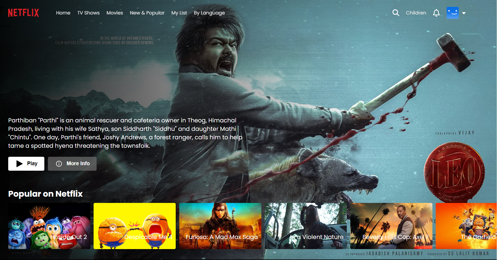

<h1>Netflix Clone Website</h1>

This repository contains a clone of Netflix, developed as a learning project to enhance my skills in web development. The clone includes:

<li>Responsive design for various screen sizes.</li>
<li>Built with HTML, CSS, JavaScript, and React.js</li>
<li>Used of IMDB Movies API and Youtube API</li>
<li>Basics Login Page</li>
<li>Create Multiple Pages using react router dom</li>

#

#

#

#

